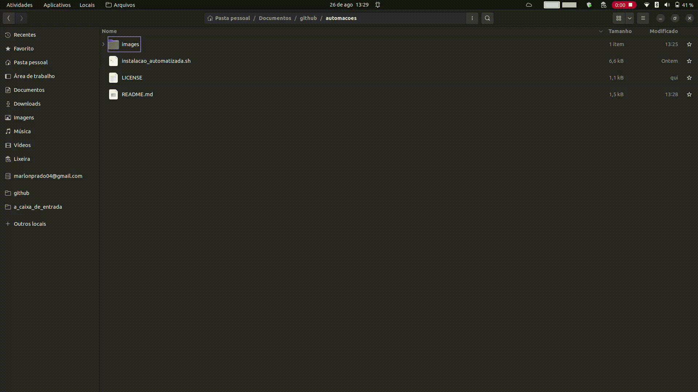
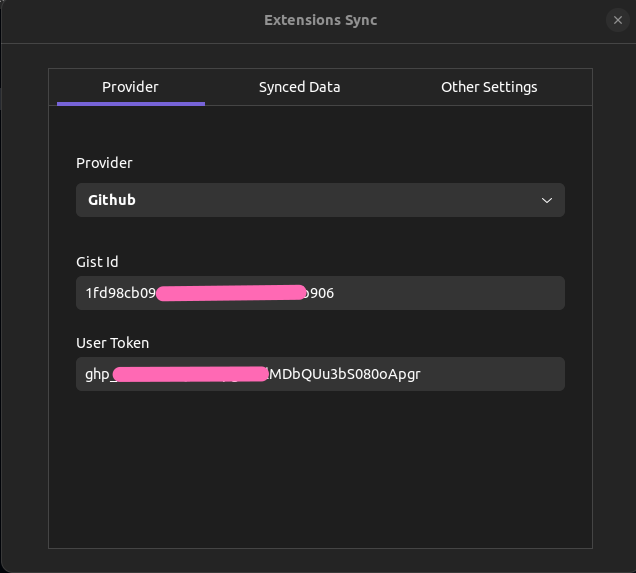

# Automações

Meus scripts e automações pessoais para lidar com configurações do sistema Ubuntu

## Índice

- [Automações](#automações)
  - [Índice](#índice)
  - [Instalação de programas](#instalação-de-programas)
    - [Passos para execução](#passos-para-execução)
    - [Lista de programas instalados](#lista-de-programas-instalados)
  - [Configuração automatizada das extensões Gnome](#configuração-automatizada-das-extensões-gnome)
  - [Verificação de repositórios git](#verificação-de-repositórios-git)
  - [Próximos passos](#próximos-passos)

## Instalação de programas

Para a instalação automatizada dos programas no Ubuntu, basta executar o arquivo `instalacao_de_programas.sh` que ele fará o download de todos os programas que faço uso em meu computador, incluindo o suporte a `Flatpak` e `Snap` junto dos programas que utilizo nestas versões de empacotamento.

### Passos para execução

1. Abrir um terminal na pasta onde o arquivo se encontra
2. Utilizar o comando `sh instalacao_automatizada`
3. Aguardar a instalação ser concluída
4. Verificar o arquivo de log gerado em busca de falhas e aplicar as correções necessárias

Abaixo uma demonstração de uso:

### Lista de programas instalados

__Instalação via APT:__

1. __gdebi__: Instala pacotes Debian (.deb) e suas dependências.
2. __synaptic__: Gerenciador de pacotes gráfico para o sistema APT.
3. __gnome-software__: Central de Programas do GNOME.
4. __gnome-sushi__: Oferece visualizações rápidas de arquivos.
5. __folder-color__: Personalização de cores de pastas no GNOME.
6. __nautilus-admin__: Opções administrativas no menu de contexto do Nautilus.
7. __imagemagick__ e __nautilus-image-converter__: Manipulação e conversão de imagens integradas ao Nautilus.
8. __chrome-gnome-shell__: Integração de extensões GNOME com Chrome/Chromium.
9. __gnome-shell-extensions__: Pacote de extensões úteis para o GNOME Shell.
10. __git__: Sistema de controle de versão distribuído.
11. __git-lfs__: Gerenciamento de arquivos grandes no Git.
12. __nodejs__: Ambiente de tempo de execução JavaScript.
13. __qbittorrent__: Cliente de torrent.
14. __kdeconnect__: Integração entre dispositivos Android e o ambiente KDE.
15. __gparted__: Utilitário de particionamento de discos.
16. __bat__: Visualizador de código com realce de sintaxe.
17. __gnome-clocks__: Relógios do gnome com função de cronômetro, alarme e etc.
18. __tree__: Visualizador de árvore de arquivos via terminal.

__Instalação via .deb:__

1. __Microsoft Edge__: Navegador de web da Microsoft.
2. __Google Chrome__: Navegador de web da Google.
3. __Microsoft Edge__: Interface gráfica para gerenciar repositórios Git e interagir com o GitHub.

__Instalação via Flatpak:__

1. __com.jetbrains.IntelliJ-IDEA-Community__: IDE para desenvolvimento Java.
2. __com.calibre_ebook.calibre__: Gerenciamento de eBooks.
3. __com.valvesoftware.Steam__: Plataforma de distribuição digital de jogos.
4. __org.eclipse.Java__: IDE para desenvolvimento Java.
5. __io.missioncenter.MissionCenter__: Gerenciamento de tarefas e produtividade.

__Instalação via Snap:__

1. __snap-store__: Loja de aplicativos Snap.
2. __code__: Visual Studio Code, editor de código fonte.
3. __curl__: Ferramenta de linha de comando para transferir dados com URLs.
4. __discord__: Plataforma de comunicação para gamers.
5. __gimp__: Programa de manipulação de imagens.
6. __netbeans__: IDE para desenvolvimento de software.
7. __btop__: Monitor de recursos de sistema em tempo real.
8. __vlc__: Reprodutor multimídia.
9. __wps-office-all-lang-no-internet__: Suite de escritório compatível com Microsoft Office.
10. __motrix__: Gerenciador de downloads.
11. __tldr__: Páginas de manual simplificadas e de fácil leitura.
12. __ncdu__: Utilitário de disco com interface de texto interativa.
13. __simplescreenrecorder__: Gravador de tela para o computador.

## Configuração automatizada das extensões Gnome

Para recuperar as `extensoes gnome e suas configurações` é necessário seguir os passos abaixo:

1. Instalar a extensão `extensions sync` do Gnome
2. Abrir meu `gist` do GitHub, [neste link](https://gist.github.com/)
3. Localizar o `gist` referente às extensões do Gnome
4. Copiar o `código id` do gist localizado
5. Adicionar o código id do gist às configurações da extensão `extensions sync`
6. Criar um `token` do GitHub que permite a criação de `gist`, [neste link](https://github.com/settings/tokens/new)
7. Adicionar o token criado nas configurações do `extensions sync`

Esses passos foram pegos [deste site](https://sempreupdate.com.br/como-sincronizar-extensoes-do-gnome-shell-entre-desktops/)

A extensão ficará configurada da seguinte forma:

## Verificação de repositórios git

Para verificar o status dos repositórios do GitHub instalados localmente, basta adicionar o código `verificacao_de_repositorios.sh` na pasta onde todos os repositórios estão alocados e executá-lo via terminal.

Abaixo um exemplo de uso:

## Próximos passos

- [x] Adicionar tree via apt
- [x] Adicionar o grub-customizer
- [x] Adicionar gnome-clocks (via apt)
- [x] Adicionar simplescreenrecorder (via snap)
- [ ] Adicionar curlew conversor de arquivos
- [ ] Adicionar gnome drawing 
- [ ] Adicionar authy
- [ ] Adicionar bitwarden
- [ ] Adicionar flameshot
- [ ] Adicionar blanket (sons para ambiente)
