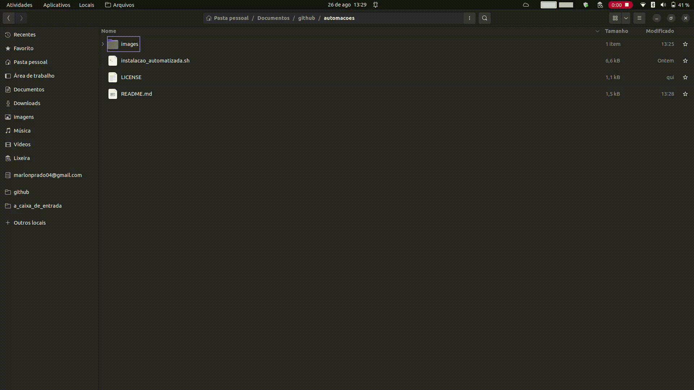
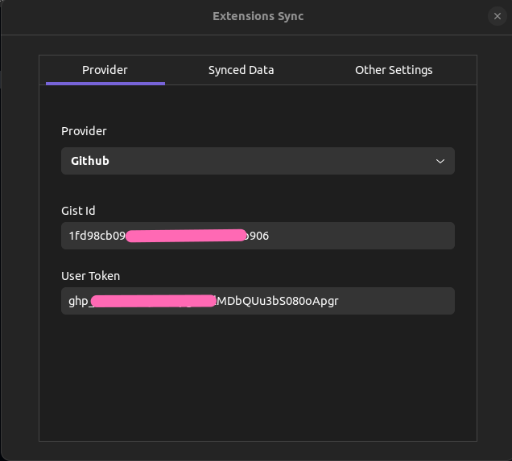

# Automações

Meus scripts e automações pessoais para lidar com configurações do sistema Ubuntu.

## Índice

- [Automações](#automações)
  - [Índice](#índice)
  - [Instalação de programas](#instalação-de-programas)
    - [Passos para execução](#passos-para-execução)
  - [Configuração automatizada das extensões Gnome](#configuração-automatizada-das-extensões-gnome)
  - [Verificação de repositórios git](#verificação-de-repositórios-git)

## Instalação de programas

Para a instalação automatizada dos programas no Ubuntu, basta executar o arquivo `instalacao_de_programas.sh`. Ele fará o download de todos os programas que faço uso em meu computador, incluindo o suporte a `Flatpak` e `Snap` junto dos programas que utilizo nestas versões de empacotamento.

### Passos para execução

1. Abrir um terminal na pasta onde o arquivo se encontra.
2. Utilizar o comando `sh instalar_programas`.
3. Aguardar a instalação ser concluída.
4. Verificar o arquivo de log gerado em busca de falhas e aplicar as correções necessárias.

Abaixo uma demonstração de uso:

## Configuração automatizada das extensões Gnome

Para recuperar as extensões Gnome e suas configurações, siga os passos abaixo:

1. Instalar a extensão **extensions sync** do Gnome.
2. Abrir meu [gist do GitHub](https://gist.github.com/).
3. Localizar o gist referente às extensões do Gnome.
4. Copiar o código ID do gist localizado na URL.
5. Adicionar o código ID do gist às configurações da extensão **extensions sync**.
6. Criar um token do GitHub que permite a criação de gists, [neste link](https://github.com/settings/tokens/new).
7. Adicionar o token criado nas configurações do **extensions sync**.

Esses passos foram retirados [deste site](https://sempreupdate.com.br/como-sincronizar-extensoes-do-gnome-shell-entre-desktops/).

A extensão ficará configurada da seguinte forma:

## Verificação de repositórios git

Para verificar o status dos repositórios do GitHub instalados localmente, basta adicionar o código `verificar_repositorios.sh` na pasta onde todos os repositórios estão alocados e executá-lo via terminal.

Abaixo um exemplo de uso:

